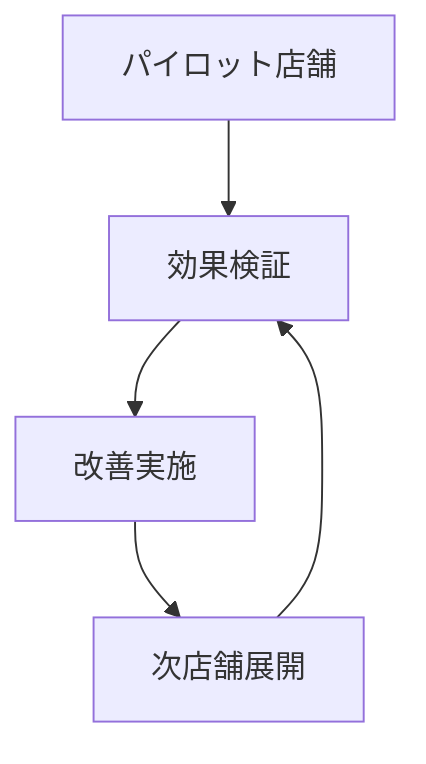

# 小売業界でのAIデータ分析：売上予測と在庫最適化

## はじめに

今回は、株式会社リテールイノベーションの佐藤美香さんにお話を伺いました。同社では、従来の経験則による発注から、AIを活用した需要予測システムへの転換を成功させ、売上向上と在庫コスト削減を同時に実現しました。

## 会社概要と課題

**── まず、会社概要と導入前の課題について教えてください。**

佐藤さん：弊社は全国に150店舗を展開する食品小売チェーンです。創業50年の老舗企業ですが、近年は以下の課題に直面していました：

### 主な課題

1. **過剰在庫と機会損失の並存**
   - 売れ筋商品の品切れが頻発
   - 一方で、売れ残り商品の廃棄コストが増大

2. **経験則への依存**
   - ベテラン店長の勘に頼った発注
   - 属人的な判断による店舗間格差

3. **季節変動への対応不足**
   - 天候や気温変化による需要変動の予測困難
   - イベントや祭日の影響を正確に織り込めない

> 「年間の廃棄ロスが売上の8%にも達し、経営の大きな負担となっていました」

## AI導入の背景

**── AI導入を決断されたきっかけは何でしたか？**

佐藤さん：転機となったのは、2023年の異常気象による大幅な売上減少でした。従来の発注システムでは、急激な環境変化に対応できないことが明らかになり、データドリブンな経営への転換が急務となりました。

## 導入したAIシステム

**── 具体的にどのようなAIシステムを導入されましたか？**

佐藤さん：弊社では、**機械学習**と**時系列分析**を組み合わせた需要予測システムを構築しました。

### システムの主要機能

#### 1. 需要予測エンジン

```python
# 需要予測モデルの概要
class DemandForecastModel:
    def __init__(self):
        self.features = [
            'historical_sales',    # 過去売上データ
            'weather_data',        # 気象データ
            'calendar_events',     # カレンダー情報
            'promotional_info',    # プロモーション情報
            'competitor_data'      # 競合情報
        ]
    
    def predict_demand(self, product_id, date):
        # 複数のアルゴリズムを組み合わせて予測
        return ensemble_prediction
```

#### 2. 在庫最適化モジュール

- **安全在庫の自動計算**
- **発注点の動的調整**
- **季節変動の考慮**

#### 3. リアルタイム分析ダッシュボード

- 店舗別売上予測の可視化
- 在庫状況のリアルタイム監視
- アラート機能（品切れ予測、過剰在庫警告）

## 導入プロセス

**── 導入はどのように進められましたか？**

### フェーズ1: データ基盤の構築（3ヶ月）

既存のPOSシステムから過去5年分のデータを収集・整理

| データ種類 | 期間 | 項目数 |
|------------|------|--------|
| 売上データ | 5年 | 10万SKU |
| 気象データ | 5年 | 7項目 |
| イベントデータ | 5年 | 500件 |

### フェーズ2: パイロット店舗での試験運用（2ヶ月）

- 5店舗での小規模テスト
- 予測精度の検証
- 運用フローの確立

### フェーズ3: 段階的展開（4ヶ月）

- 月20店舗のペースで順次展開
- 各店舗でのカスタマイズ
- 効果測定と改善

## 導入成果

**── 導入後の具体的な成果について教えてください。**

佐藤さん：導入から12ヶ月が経過し、期待を大幅に上回る成果を得ています：

### 定量的成果

| 指標 | 導入前 | 導入後 | 改善率 |
|------|--------|--------|--------|
| 予測精度 | 65% | 92% | **42%向上** |
| 廃棄ロス率 | 8.2% | 3.1% | **62%削減** |
| 品切れ率 | 12% | 4% | **67%削減** |
| 在庫回転率 | 24回/年 | 36回/年 | **50%向上** |
| 粗利益率 | 22% | 28% | **27%向上** |

### 特筆すべき成果

#### 1. 天候連動型予測の成功

```
夏季の猛暑日予測時：
- アイスクリーム: 通常比180%の需要予測
- 冷たい飲み物: 通常比150%の需要予測
→ 品切れ率をほぼ0%に削減
```

#### 2. イベント連動型在庫管理

- バレンタインデー、クリスマスなど季節商品の最適発注
- 地域イベントに合わせた商品構成の自動調整

## 運用体制と工夫

**── 成功の要因は何だと思いますか？**

佐藤さん：以下の3点が特に重要だったと思います：

### 1. 段階的な導入と継続的改善



### 2. 現場スタッフとの連携

- 店長・スタッフ向けの研修実施
- システムの予測結果に対する現場判断の余地を残す
- 月次の振り返り会議で改善点を共有

### 3. 外部データの積極活用

- 気象庁データの自動取得
- 競合店舗情報の収集
- SNSトレンドデータの分析

## 技術的な工夫

**── システム構築で特に工夫された点はありますか？**

佐藤さん：以下の技術的工夫が効果的でした：

### 1. アンサンブル学習の採用

```python
# 複数モデルの組み合わせ
models = [
    RandomForestRegressor(),
    GradientBoostingRegressor(),
    LGBMRegressor(),
    TimeSeriesForecaster()
]

# 予測結果の重み付け平均
final_prediction = weighted_average(predictions)
```

### 2. リアルタイム学習機能

- 新しい売上データを即座に学習に反映
- 季節変動パターンの自動更新
- 外れ値の自動検出と除外

### 3. 説明可能AI（XAI）の実装

店舗スタッフが予測根拠を理解できるよう、予測要因の可視化機能を実装

## 今後の展望

**── 今後の計画について教えてください。**

佐藤さん：現在、以下の機能拡張を進めています：

### 1. 顧客行動分析の強化

- 購買パターンの分析
- 顧客セグメント別の需要予測
- レコメンデーション機能の追加

### 2. サプライチェーン最適化

- 物流コストの最適化
- 仕入先選定の自動化
- 配送ルートの最適化

### 3. 競合分析の高度化

- 価格競争力の分析
- 商品ラインナップの最適化
- 立地分析の精度向上

## 導入時の課題と対策

**── 導入時に直面した課題はありましたか？**

佐藤さん：主に以下の課題がありました：

### 1. データ品質の問題

**課題**: 過去データに欠損や誤りが多数存在

**対策**:
- データクレンジングツールの導入
- 自動検証ルールの設定
- 段階的なデータ品質向上

### 2. 現場の抵抗

**課題**: ベテランスタッフからの反発

**対策**:
- 段階的な導入による不安軽減
- 成功事例の共有
- 継続的な教育・研修

### 3. システム統合の複雑性

**課題**: 既存システムとの連携

**対策**:
- APIによる疎結合設計
- 段階的な移行計画
- バックアップシステムの併用

## 投資対効果（ROI）

**── 導入コストと効果について教えてください。**

### 初期投資

| 項目 | 金額 |
|------|------|
| システム開発 | 3,000万円 |
| データ基盤構築 | 1,500万円 |
| 研修・運用準備 | 500万円 |
| **合計** | **5,000万円** |

### 年間効果

| 項目 | 金額 |
|------|------|
| 廃棄ロス削減 | 8,000万円 |
| 売上増加 | 3,000万円 |
| 人件費削減 | 1,200万円 |
| **合計** | **1億2,200万円** |

**ROI**: **144%**（1年目）

## まとめ

**── 最後に、AI導入を検討されている企業へのアドバイスをお願いします。**

佐藤さん：**AIは魔法ではありませんが、適切に活用すれば確実に成果を出せます**。重要なのは以下の点です：

1. **明確な目標設定**: 何を解決したいのかを明確にする
2. **データの重要性**: 質の高いデータが成功の鍵
3. **段階的アプローチ**: 小さく始めて徐々に拡大
4. **現場との連携**: 技術と現場知識の融合
5. **継続的改善**: 導入後も持続的な改善が必要

> 「AIは道具です。大切なのは、その道具を使って何を実現したいかという明確なビジョンを持つことです」

弊社の事例が、皆様のAI導入の参考になれば幸いです。

---

*この記事についてより詳しく知りたい方は、下記の無料相談をご活用ください。*